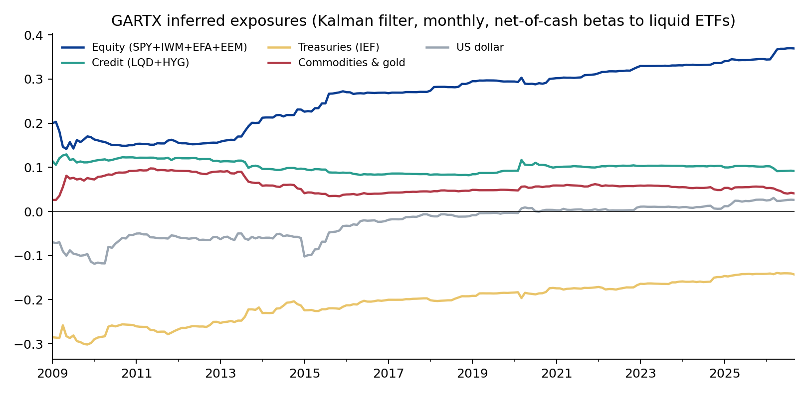
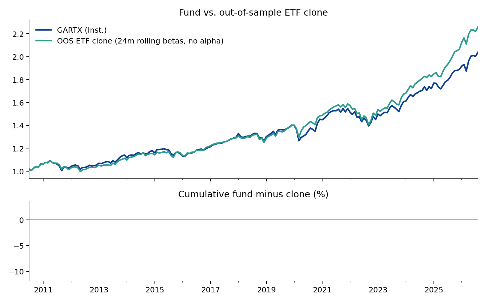
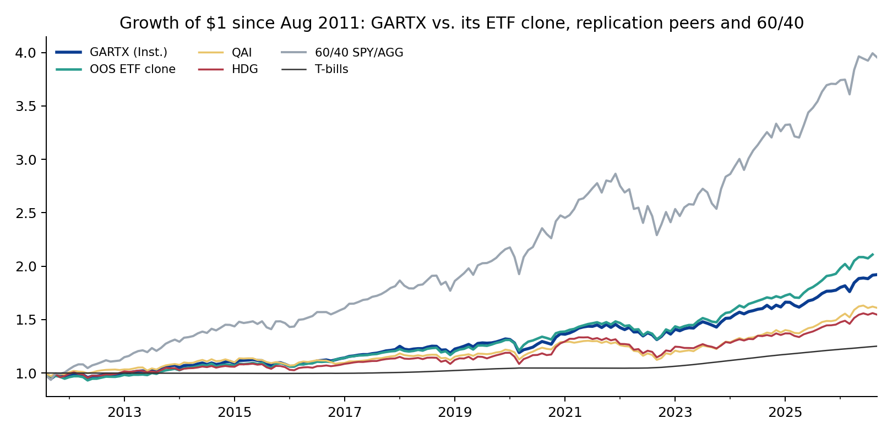

# GS QIS Product Review — Part 1: Absolute Return Tracker (GARTX / GJRTX)

*An independent analysis from public data, written the way a client portfolio manager would brief a client. Hugo Hoenn, September 2026.*

The Goldman Sachs Absolute Return Tracker Fund is Goldman Sachs Asset Management's hedge fund replication product, run by the
Quantitative Investment Strategies team since May 2008. Its objective is to approximate "the return and risk patterns of a diversified
universe of hedge funds" using liquid instruments. Institutional class GJRTX: 0.74% net expense ratio, ~$6.1bn, 134% turnover; the reported
holdings are total-return swaps, index futures, credit default swap indices and ETFs. This note asks the three questions a client would ask.

## 1. What does it actually hold?

Regressing GJRTX's monthly excess returns (Jul 2008 – Sep 2026, 219 months) on ten liquid ETFs explains **89%** of its variance:

| ETF | Exposure | Beta | t |
|---|---|---|---|
| Alpha (ann.) | Residual (annualised) | -0.010 | -2.4 |
| SPY | US large cap | +0.173 | 6.0 |
| IWM | US small cap | +0.053 | 4.9 |
| EFA | Developed ex-US | +0.085 | 3.5 |
| EEM | Emerging markets | +0.026 | 1.8 |
| IEF | 7-10y Treasuries | -0.149 | -2.3 |
| LQD | IG credit | +0.189 | 3.3 |
| HYG | High yield | -0.118 | -2.8 |
| DBC | Commodities | +0.015 | 1.1 |
| GLD | Gold | +0.032 | 2.6 |
| UUP | US dollar | +0.035 | 1.0 |

Read as a portfolio: roughly a third in global equities (US large and small, developed and emerging), a long investment-grade credit position
funded by short high-yield and short Treasuries (a credit-spread and duration-short stance), a small gold position, and the remainder in cash.
The residual is **-1.0%/yr (t = -2.4)**, statistically significant and roughly equal to the fee. That is what a tracker should show:
no unexplained return, positive or negative, beyond costs.

A Fama-French 5-factor + momentum regression tells the same story from the style side: market beta 0.33 (t = 23), no significant
size, value, profitability, investment or momentum tilt, R² 0.83. The fund is hedge fund *beta*, as advertised, not hedge fund *alpha*.

**Exposures have drifted.** A Kalman filter with random-walk betas shows equity exposure rising from about 0.16 (2009–13) to 0.35 today,
the Treasury short shrinking from -0.28 to -0.14, and a dollar short that closed after 2017. Either the hedge fund universe the fund tracks has become
more equity-directional, or the tracking methodology has, and a client should ask which. It matters because a 0.37 beta fund behaves very
differently in a drawdown from a 0.15 beta fund.

## 2. Could a client replicate it with ETFs?

Yes, closely. An out-of-sample clone that re-estimates the ten betas every month on the trailing 24 months and holds those ETF weights the
following month (no alpha term, since alpha cannot be bought) tracks the fund with **2.0% tracking error and 0.94 correlation** since Jul 2010.
The clone returned 5.2%/yr against the fund's 4.5%: a 0.7%/yr gap, almost exactly the expense ratio.

This is not a criticism of the fund; it is the fund working. A replication product's promise is liquid, transparent hedge fund beta at low cost,
and the fee is what a client pays for the daily rebalancing, the 3,000-fund universe, and not having to run a regression every month. But it does
frame the pricing conversation: the marginal value of the product over a static ETF basket is about 70 basis points a year.

## 3. How does it compare, and what is it for?

Common window from Aug 2011 (when all peers exist):

| | Ann. return | Vol | Sharpe | Max DD | Beta to SPY | Corr. to SPY |
|---|---|---|---|---|---|---|
| GARTX (Inst.) | 4.4% | 5.7% | 0.53 | -9.8% | 0.37 | 0.93 |
| GARTX (A) | 4.0% | 5.7% | 0.46 | -10.1% | 0.37 | 0.93 |
| QAI | 3.2% | 5.1% | 0.36 | -13.8% | 0.31 | 0.86 |
| HDG | 2.9% | 5.7% | 0.27 | -14.1% | 0.35 | 0.87 |
| 60/40 SPY/AGG | 9.5% | 9.2% | 0.87 | -20.0% | 0.64 | 0.98 |
| ETF clone (OOS) | 5.1% | 5.6% | 0.66 | -11.4% | 0.36 | 0.92 |
| T-bills | 1.5% | 0.6% | — | -0.4% | 0.00 | 0.00 |

GJRTX is the best of the three hedge fund replicators on every risk-adjusted measure: higher Sharpe, smaller drawdown, and it beat both QAI and HDG
on raw return. Against a plain 60/40, however, it lost on Sharpe (0.53 vs 0.87) and, more importantly for its intended role, it is **0.93 correlated
with the S&P 500**. It is a low-volatility, low-beta equity-and-credit portfolio that dampens drawdowns; it is not an uncorrelated diversifier.

| Period | GARTX | SPY | 60/40 | QAI |
|---|---|---|---|---|
| GFC (Jul 2008-Feb 2009) | -14.9% | -41.4% | -25.9% | n/a |
| 2011 (Aug-Sep) | -5.5% | -12.1% | -6.4% | -2.8% |
| Q4 2018 | -5.1% | -13.5% | -7.4% | -4.2% |
| COVID (Feb-Mar 2020) | -9.4% | -19.4% | -11.5% | -7.0% |
| 2022 | -6.3% | -18.2% | -15.8% | -8.7% |

In every stress episode since launch the fund lost roughly a third to half of what US equities lost, and less than 60/40 in three of five. That is
exactly the risk pattern of the hedge fund industry in aggregate, which is the objective. A client who owns it for downside cushioning has been
served; a client who owns it as a substitute for uncorrelated alpha has not, and the 0.93 correlation is the number to lead with.

## What this analysis cannot tell you

- It says nothing yet about how well the fund tracks its target. That needs the HFRX Global Hedge Fund Index (Part 1b, on receipt of the index history).
- Returns are net of fund fees but before any advisory fee; the ETF clone ignores its own trading costs, which at 24-month rebalancing are small.
- The ten-ETF basket is a choice. A richer basket (volatility, trend, merger arbitrage proxies) would raise R² further; 0.89 is already a high bar.
- The fund's stated goal is to track hedge fund returns, not to beat 60/40. Comparing it to 60/40 answers a client question, not the fund's mandate.

## Method and code

`src/data.py` pulls prices (Yahoo Finance). `src/gartx.py` runs static OLS with HAC errors, 24-month rolling OLS, a random-walk Kalman filter with
the state noise chosen by one-step-ahead likelihood, the out-of-sample clone, the Fama-French regression and peer metrics. `src/charts.py` draws the
figures. All tables are in `output/gartx_*.csv`. Licensed index data (HFRX) is kept out of the repository; only derived statistics are published.

*Independent research for discussion purposes. Not affiliated with or endorsed by Goldman Sachs. Not investment advice.*
