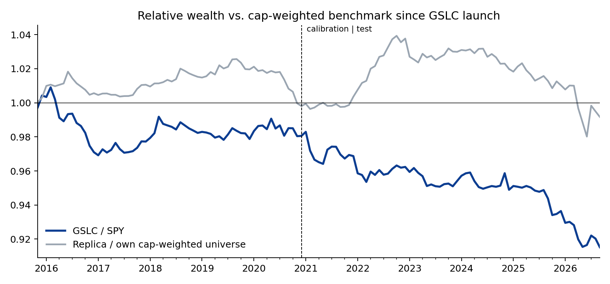
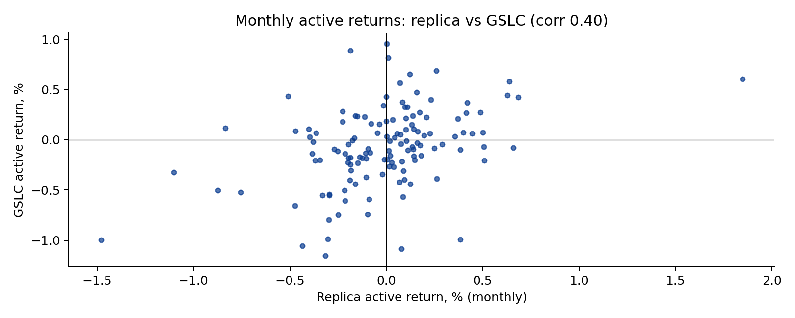
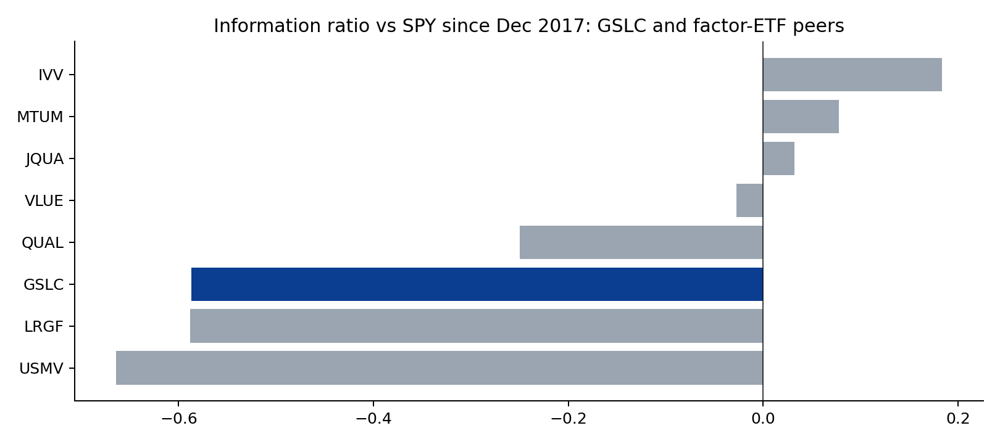

# GS QIS Product Review — Part 2: ActiveBeta U.S. Large Cap (GSLC)

*Rebuilding Goldman Sachs' flagship smart-beta ETF from its published rulebook, and asking what a client should make of its record. Hugo Hoenn, September 2026.*

GSLC tracks the Goldman Sachs ActiveBeta® U.S. Large Cap Equity Index, run by the QIS team since September 2015 (~$10bn+, 0.09% fee).
The methodology is public (Solactive/GSAM, April 2024): four factor subindexes (value, momentum, quality, low volatility) built with a
patented rank-based over/underweighting scheme, sector and beta bands, equal-weighted and rebalanced quarterly with a turnover-minimisation
step. Two questions: **how much of the ETF's behaviour can an outsider reproduce from the rulebook alone**, and **what has the product
delivered relative to the S&P 500 and its peers?**

## 1. The rulebook, implemented

Everything the document publishes is implemented as written: the exact factor definitions (composite of book/price, sales/price and cash
flow/price with earnings/price for financials; beta- and volatility-adjusted 11-month momentum; gross profit over assets with an ROE fallback;
inverse 12-month volatility), ranks mapped to fractional scores on [−1, +1], the underweight-to-zero and proportional-overweight mechanics,
a cap relative to universe weight, sector neutrality, equal weighting of the four subindexes, and quarterly rebalancing. Two parameters the
document withholds — the Cut-off Score and the Maximum Stock Underweight — were fitted on 2015–20 (best: cut-off +0.00, max underweight
1.00%, cap 5× universe weight) and held fixed for 2021–26. Not implemented, and disclosed: the turnover-minimisation technique,
beta bands, the 2 bp minimum weight, and the exact Solactive universe (the current S&P 500 is used as a proxy; free cash flow is proxied by
operating cash flow).

## 2. How close does the rulebook get you?

Close on the surface, far on what matters. The replica's *total* returns correlate 0.99 with GSLC, but so does anything that owns 400
large-cap US stocks. The meaningful test is the **active** return — GSLC minus the S&P 500 versus the replica minus its own universe:

| | Calibration 2015–20 | Test 2021–26 | Full |
|---|---|---|---|
| GSLC active vs SPY (ann.) | -0.4% | -1.4% | -0.9% |
| Replica active vs own universe (ann.) | -0.0% | -0.1% | -0.1% |
| GSLC TE vs SPY | 1.3% | 1.4% | 1.4% |
| Replica TE vs universe | 0.9% | 1.5% | 1.3% |
| Corr of active returns | 0.39 | 0.42 | 0.40 |
| Sign agreement (months) | 66.1% | 59.4% | 62.6% |

The published rules recover a correlation of about **0.40** between the two active-return series, stable in and out of sample (so the two fitted
parameters are not doing the work), with the sign right in about 63% of months. Put differently, the rulebook explains roughly one sixth of the
variance of GSLC's active returns. The other five sixths live in what is not published: the turnover-minimisation step (which, at a 1.3% tracking
error, can easily dominate quarter-to-quarter behaviour), the beta constraint, the exact universe, and data-vendor differences in the fundamental
inputs. That is the honest answer to "can you replicate it": the *design* is transparent; the *implementation* is not, and at this tracking error
the implementation is most of the product.

## 3. What the product has delivered

| Year | GSLC | SPY | GSLC active |
|---|---|---|---|
| 2015 | -0.9% | -1.4% | +0.4% |
| 2016 | 8.3% | 12.0% | -3.7% |
| 2017 | 22.5% | 21.7% | +0.8% |
| 2018 | -4.1% | -4.6% | +0.5% |
| 2019 | 30.7% | 31.2% | -0.5% |
| 2020 | 18.6% | 18.3% | +0.2% |
| 2021 | 27.2% | 28.7% | -1.6% |
| 2022 | -18.7% | -18.2% | -0.5% |
| 2023 | 25.1% | 26.2% | -1.1% |
| 2024 | 24.2% | 24.9% | -0.7% |
| 2025 | 16.2% | 17.7% | -1.6% |
| 2026 | 10.7% | 13.3% | -2.6% |

Since launch GSLC has trailed the S&P 500 by **-0.9%/yr** with a **1.4%** tracking error — an information ratio near −0.6 — and the shortfall has
widened since 2021 (-1.4%/yr). The fee explains a tenth of it. A regression of the active returns on Fama-French 5 + momentum shows where the rest comes from:

| Factor | Loading | t |
|---|---|---|
| Alpha (ann.) | -0.007 | -2.0 |
| Mkt-RF | -0.015 | -2.1 |
| SMB | +0.050 | 3.8 |
| HML | -0.043 | -2.8 |
| RMW | +0.051 | 3.6 |
| CMA | +0.019 | 1.0 |
| MOM | +0.027 | 2.3 |

R² 0.23. The product carries the exposures it advertises — quality (profitability, t = 3.6) and momentum (t = 2.3) — plus a small-cap tilt
(SMB t = 3.8) that comes from underweighting the mega-caps, and, notably, a **negative** loading on the value factor as Fama-French define it
(HML t = -2.8) despite a value subindex. The residual alpha is -0.7%/yr (t = -2.0). Regressing instead on the four single-factor sleeves
from my own factor pipeline (Part 0) points the same way — GSLC's active returns are explained by quality and low volatility, not by value:

| Sleeve (my pipeline, active vs. universe) | Loading | t |
|---|---|---|
| Alpha (ann.) | -0.006 | -1.7 |
| value | -0.048 | -1.3 |
| momentum | +0.031 | 1.4 |
| quality | +0.210 | 3.8 |
| lowvol | +0.080 | 2.8 |

The client conversation follows directly. GSLC has done what a four-factor smart-beta product is designed to do: hold quality, momentum and
low-volatility tilts at a very low tracking error. Those tilts have cost about 90 bp a year in a market led by a handful of mega-cap growth
stocks, and the negative mega-cap exposure (the small-cap loading) is the mechanical reason. A client who bought it as a mild, cheap factor
tilt has received exactly that; a client who bought it expecting to beat the index has been disappointed for eleven years, and should be told
plainly that eleven years is still too short to settle whether the premia will pay.

## 4. Peer group

Since Dec 2017 (when all peers except DFAC have history):

| ETF | Fee | Ann. return | Active vs SPY | TE | IR | Sharpe | Max DD |
|---|---|---|---|---|---|---|---|
| GSLC | 0.09% | 13.7% | -0.8% | 1.3% | -0.59 | 0.73 | -24.5% |
| IVV | 0.03% | 14.6% | +0.1% | 0.3% | 0.18 | 0.77 | -23.9% |
| LRGF | 0.08% | 12.6% | -2.0% | 3.0% | -0.59 | 0.65 | -22.8% |
| QUAL | 0.15% | 13.6% | -1.0% | 3.2% | -0.25 | 0.70 | -27.8% |
| MTUM | 0.15% | 14.9% | +0.3% | 10.3% | 0.08 | 0.69 | -30.2% |
| VLUE | 0.15% | 13.4% | -1.1% | 10.3% | -0.03 | 0.60 | -29.0% |
| USMV | 0.15% | 9.1% | -5.4% | 8.1% | -0.66 | 0.55 | -19.1% |
| JQUA | 0.12% | 14.9% | +0.3% | 4.2% | 0.03 | 0.82 | -22.1% |

Every multi-factor and defensive product in the group has trailed the S&P 500 over this window; the single-factor momentum and quality ETFs
roughly matched it. GSLC sits in the middle of the pack on information ratio, behind JQUA and QUAL and ahead of LRGF and USMV, at a fee below all
of them except the plain index fund. Relative to its direct competitor LRGF it has half the tracking error and a similar shortfall.

## What this analysis cannot tell you

- Whether GSLC will outperform going forward. Eleven years, one regime dominated by mega-cap growth. The factor evidence outside this window is long and international; the evidence inside it is negative.
- The exact reason the replica captures only 40% of the active variance: several unpublished elements are confounded and cannot be separated without the index's actual weights history (available from Solactive to licensees).
- Anything about GSIE or GEM, the international and emerging-market siblings, which use MSCI universes not covered here.

## Method and code

`src/gslc.py` builds the factor inputs from the Part 0 pipeline (SEC EDGAR point-in-time fundamentals, yfinance prices), implements rulebook
sections 1.0–2 as written, fits the two unpublished parameters on 2015–20 and runs the replica through Sep 2026. `src/gslc_analysis.py` does the
active-return comparison against a same-universe benchmark (which removes survivorship bias from the comparison), the Fama-French and sleeve
regressions, the peer table and charts. Tables: `output/gslc_*.csv`.

*Independent research for discussion purposes. Not affiliated with or endorsed by Goldman Sachs. Not investment advice.*
